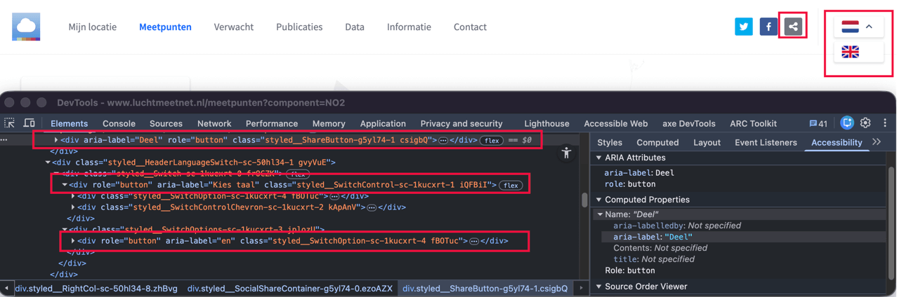
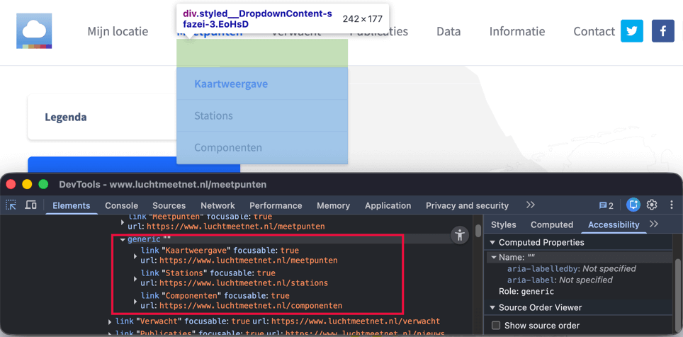
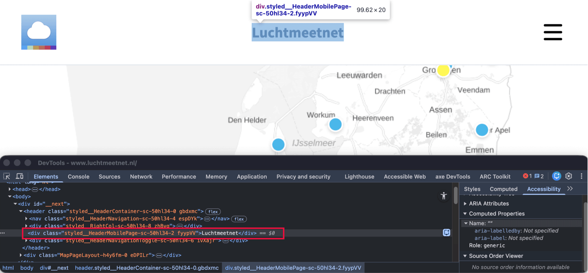

### Knappar utan tangentbordsstyrning

	<b>Påverkan</b>: Stor
	<b>Typ</b>: Teknik
	<b>WCAG</b>: 2.1.1
	<b>EN</b>: 9.2.1.1

<figure class="screenshot">

</figure>

I webbplatsens sidhuvud kan följande knappar inte styras med tangentbordet: knappen med delningsikonen med `aria-label="Deel"`, knappen med flaggikonen med `aria-label="Kies taal"` och knapparna i språkundermenyn, till exempel knappen med `aria-label="en"`.

Knapparna kan inte nås via tangentbordet. Därför hoppas knapparna över när besökare navigerar med tangentbordet. Interaktiva element måste kunna styras helt med tangentbordet.

#### Lösning:

Se till att knapparna kan styras med tangentbordet, till exempel med Enter-, Return- eller mellanslagstangenten.

### Undermenyer utan tangentbordsstyrning

	<b>Påverkan</b>: Stor
	<b>Typ</b>: Teknik
	<b>WCAG</b>: 2.1.1
	<b>EN</b>: 9.2.1.1

I webbplatsens sidhuvud visar länkarna "Meetpunten" och "Data" undermenyer vid hovring. Dessa undermenyer visas inte vid tangentbordsstyrning.

#### Lösning:

Se till att det extra innehållet också kan öppnas med tangentbordet.

### Hovringsinnehåll kan inte stängas

	<b>Påverkan</b>: Stor
	<b>Typ</b>: Teknik
	<b>WCAG</b>: 1.4.13
	<b>EN</b>: 9.1.4.13

När musen förs över länkarna "Meetpunten" och "Data" i huvudmenyn visas extra innehåll som överlappar det befintliga sidinnehållet.

#### Lösning:

Se till att detta extra innehåll kan stängas utan att använda musen och utan att tangentbordsfokus behöver flyttas. Stöd till exempel stängning med Escape-tangenten.

### 'aria-expanded' saknas vid undermeny

	<b>Påverkan</b>: Stor
	<b>Typ</b>: Teknik
	<b>WCAG</b>: 4.1.2
	<b>EN</b>: 9.4.1.2

I webbplatsens sidhuvud har länkarna "Meetpunten" och "Data" undermenyer. När en skärmläsaranvändare öppnar menyn förmedlas inte om undermenyn är öppen eller stängd.

När en undermeny finns måste elementet som öppnar undermenyn ange om undermenyn är synlig eller dold.

#### Lösning:

Använd attributet `aria-expanded` på knappen eller länken som öppnar undermenyn.

### Gruppering av länkar saknas i HTML

	<b>Påverkan</b>: Medel
	<b>Typ</b>: Teknik
	<b>WCAG</b>: 1.3.1
	<b>EN</b>: 9.1.3.1

<figure class="screenshot">

</figure>

I webbplatsens sidhuvud har länkarna "Meetpunten" och "Data" undermenyer. I dessa undermenyer presenteras länkar visuellt som en grupp, men denna gruppering är inte fastställd i HTML-strukturen.

När det för seende besökare är tydligt att länkar hör ihop, måste denna struktur också finnas i HTML-koden.

#### Lösning:

Placera de grupperade länkarna i ett `ul`-element.

### Aktuell sida inte markerad i koden

	<b>Påverkan</b>: Medel
	<b>Typ</b>: Teknik
	<b>WCAG</b>: 1.3.1
	<b>EN</b>: 9.1.3.1

I huvudmenyn har den aktiva länken ett avvikande visuellt utseende. Denna distinktion är inte fastställd i koden. Därför är det inte tydligt för skärmläsaranvändare vilken sida som är aktiv.

#### Lösning:

Se till att det i koden fastställs vilken sida som är aktiv. Lägg till exempel till `aria-current="true"` på den aktiva länken. Andra alternativ är en `h1`-rubrik med samma text som menyposten eller användning av sidtiteln (`title`).

### Ologisk fokusordning

	<b>Påverkan</b>: Stor
	<b>Typ</b>: Teknik
	<b>WCAG</b>: 2.4.3
	<b>EN</b>: 9.2.4.3

I sidhuvudet visas det tillhörande innehållet när länkarna i huvudmenyn aktiveras. Tangentbordsfokus flyttas därefter inte till detta nyöppnade innehåll, utan till nästa interaktiva element i sidhuvudet. Därmed uppstår en ologisk fokusordning.

#### Lösning:

Se till att tangentbordsfokus vid öppning av innehåll flyttas till det nyvisade innehållet och att fokusordningen överensstämmer med sidans visuella ordning.

### title-elementet uppdateras inte dynamiskt

	<b>Påverkan</b>: Medel
	<b>Typ</b>: Teknik
	<b>WCAG</b>: 2.4.2
	<b>EN</b>: 9.2.4.2

På denna webbplats ändras sidornas innehåll dynamiskt, men texten i `<title>`-elementet ändras inte med. Därför stämmer sidtiteln inte överens med sidans aktuella innehåll. Dessutom är titeln "Luchtmeetnet.nl" inte en bra beskrivning av sidans innehåll.

Skärmläsaranvändare använder ofta sidtiteln för att förstå vad sidan handlar om. När titeln inte stämmer överens med sidans aktuella innehåll kan detta vara förvirrande.

Detta problem förekommer bland annat på:

- [<https://www.luchtmeetnet.nl/>](https://www.luchtmeetnet.nl/)
- [<https://www.luchtmeetnet.nl/meetpunten>](https://www.luchtmeetnet.nl/meetpunten)
- [<https://www.luchtmeetnet.nl/stations>](https://www.luchtmeetnet.nl/stations).

Ett liknande problem förekommer också på sidorna:

- [<https://www.luchtmeetnet.nl/informatie/download-data/tijdnotatie>](https://www.luchtmeetnet.nl/informatie/download-data/tijdnotatie)
- [<https://www.luchtmeetnet.nl/informatie/download-data/download-statistieken>](https://www.luchtmeetnet.nl/informatie/download-data/download-statistieken)
- [<https://www.luchtmeetnet.nl/informatie/metingen/keuze-meetlocaties>](https://www.luchtmeetnet.nl/informatie/metingen/keuze-meetlocaties)

#### Lösning:

Se till att texten i `<title>`-elementet uppdateras automatiskt när sidans innehåll ändras dynamiskt.

Se dessutom till att `<title>`-elementet på varje sida är unikt och noggrant beskriver den aktuella sidans innehåll, gärna kompletterat med organisationens namn.

### Rubrik inte markerad i koden

	<b>Påverkan</b>: Medel
	<b>Typ</b>: Innehåll
	<b>WCAG</b>: 1.3.1
	<b>EN</b>: 9.1.3.1

<figure class="screenshot">

</figure>

När denna webbplats sidor visas på en liten skärm finns det texter som inte är markerade som rubrik, bland annat:

- [<https://www.luchtmeetnet.nl/>](https://www.luchtmeetnet.nl/) - texten "Luchtmeetnet"
- [<https://www.luchtmeetnet.nl/meetpunten>](https://www.luchtmeetnet.nl/meetpunten) - texten "Meetpunten"
- [<https://www.luchtmeetnet.nl/nieuws>](https://www.luchtmeetnet.nl/nieuws) - texten "Publicaties"

För besökare som använder hjälpmedel är text som visuellt är utformad som rubrik men inte är markerad som rubrik i koden inte användbar. De navigerar via rubriker för att skanna innehållet eller snabbt komma till en specifik sektion. Detta är bara möjligt när rubriker också är fastställda som rubriker i koden.

När rubriker enbart är visuellt utformade, till exempel genom fetstil, avviker informationsstrukturen i koden från sidans visuella struktur.

På denna sida finns en instruktion för att testa rubrikstrukturen på en webbsida: [<https://properaccess.nl/zo-controleer-je-de-koppenstructuur-van-je-website/>](https://properaccess.nl/zo-controleer-je-de-koppenstructuur-van-je-website/).

#### Lösning:

Markera rubriker med rätt `HTML`-element och använd rätt rubriknivå (h1 till och med h6).

### Knappfunktion saknas

	<b>Påverkan</b>: Stor
	<b>Typ</b>: Teknik
	<b>WCAG</b>: 1.1.1, 4.1.2
	<b>EN</b>: 9.1.1.1, 9.4.1.2

Överst på webbplatsen finns, när den visas på en liten skärm, en klickbar ikon med tre horisontella linjer. Detta element fungerar som en knapp men har inte rätt tillgänglighetsroll. Ikonen har heller inget textalternativ.

När en knapp enbart består av en bild måste bildens textalternativ beskriva knappens funktion. Detta problem förekommer även vid flaggbilderna i denna meny, som fungerar som knappar för att byta sidans språk.

#### Lösning:

Se till att knappen har rätt tillgänglighetsroll. Använd `<button>`-elementet för detta. Lägg till ett textalternativ som beskriver knappens funktion. Detta kan göras genom ett textalternativ vid ikonen eller genom att lägga till ett `aria-label` på knappen.
När ikonen aktiveras ändras den till ett kryss och knappens funktion ändras till att stänga menyn. Se till att textalternativet ändras i takt med denna funktion.

### Menyknappens status saknas

	<b>Påverkan</b>: Stor
	<b>Typ</b>: Teknik
	<b>WCAG</b>: 4.1.2
	<b>EN</b>: 9.4.1.2

På en liten skärm finns en menyknapp med tre horisontella linjer för att öppna den mobila navigeringsmenyn. Knappen ger ingen information om menyns tillstånd (öppen eller stängd) till besökare som inte kan se detta, som skärmläsaranvändare.

#### Lösning:

Se till att menyns status också finns tillgänglig i koden. Använd till exempel attributet `aria-expanded` på menyknappen. Sätt detta attribut till "true" när menyn är öppnad och till "false" när menyn är stängd.

### Menyknapp utan tangentbordsstyrning

	<b>Påverkan</b>: Stor
	<b>Typ</b>: Teknik
	<b>WCAG</b>: 2.1.1
	<b>EN</b>: 9.2.1.1

På en liten skärm finns en menyknapp med tre horisontella linjer för att öppna den mobila navigeringsmenyn. Denna knapp kan inte styras med tangentbordet.

Knappen kan inte nås via tangentbordet. Därför hoppas knappen över när besökare navigerar med tangentbordet. Interaktiva element måste kunna styras helt med tangentbordet.

Detta problem gäller även knapparna i denna meny som används för att byta sidornas språk.

#### Lösning:

Se till att en knapp kan styras med tangentbordet, till exempel med Enter-, Return- eller mellanslagstangenten.

### Fokus flyttas inte till mobilmenyn

	<b>Påverkan</b>: Stor
	<b>Typ</b>: Teknik
	<b>WCAG</b>: 2.4.3, 2.4.11
	<b>EN</b>: 9.2.4.3

På en liten skärm finns en menyknapp med tre horisontella linjer för att öppna den mobila navigeringsmenyn. När menyn öppnas flyttas inte tangentbordsfokus till den mobila menyn.

Dessutom kan interaktiva element på den underliggande sidan fortfarande få tangentbordsfokus medan menyn är öppen. Dessa element är vid det tillfället inte synliga, eftersom menyn ligger ovanpå dem.

#### Lösning:

Se till att tangentbordsfokus vid öppning av menyn flyttas till den mobila menyn. Så länge menyn är öppen ska fokus stanna i menyn och inte hamna på den underliggande sidan.

På denna sida finns en instruktion för att själv testa fokusordningen: [<https://properaccess.nl/hoe-test-ik-focusvolgorde/>](https://properaccess.nl/hoe-test-ik-focusvolgorde/).

