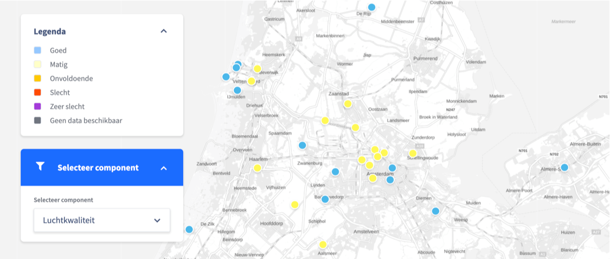
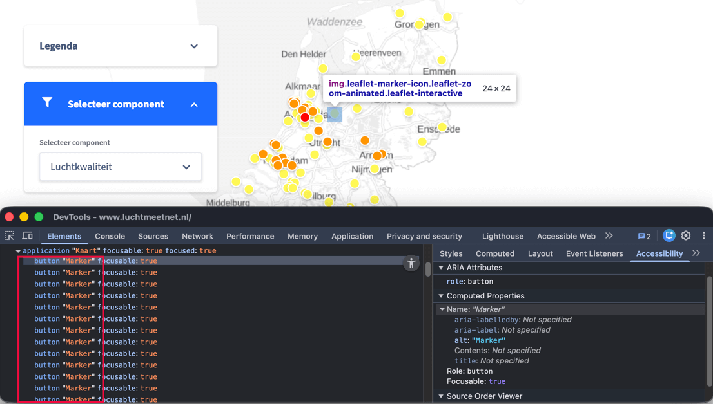
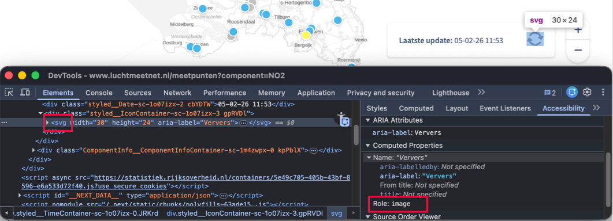
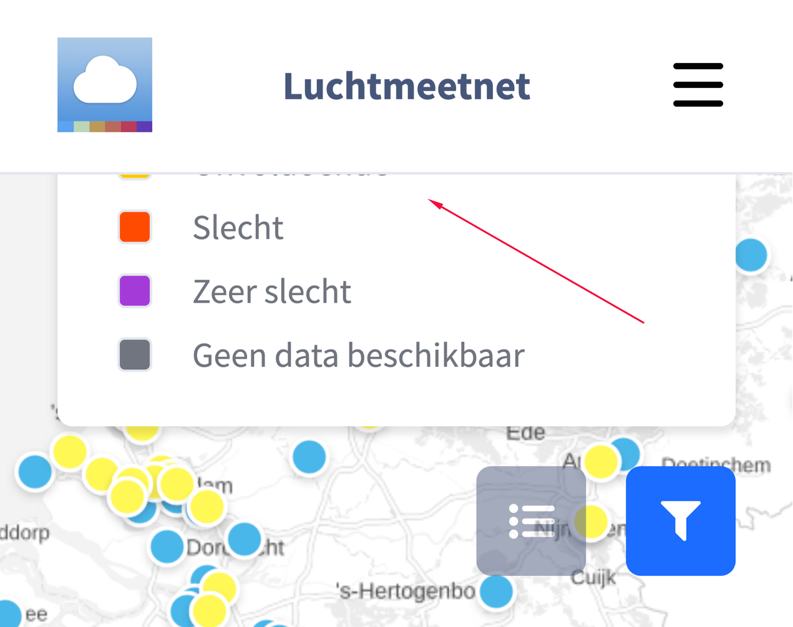

Länk till sidan: [<https://www.luchtmeetnet.nl/>](https://www.luchtmeetnet.nl/)

### Fokusindikator saknas

	<b>Påverkan</b>: Stor
	<b>Typ</b>: Teknik
	<b>WCAG</b>: 2.4.7
	<b>EN</b>: 9.2.4.7

På denna sida får elementet med `role="application"` och `aria-label="Kaart"` tangentbordsfokus. Det finns ingen synlig fokusindikator när detta element har fokus.

#### Lösning:

Se till att tangentbordsfokus är synlig på fokuserbara element, så att besökare vet när de kan trycka på en knapp.

### Felaktig roll för dragspelsknappar

	<b>Påverkan</b>: Stor
	<b>Typ</b>: Teknik
	<b>WCAG</b>: 1.3.1, 4.1.2
	<b>EN</b>: 9.1.3.1, 9.4.1.2

På denna sida saknar elementen som öppnar och stänger dolt innehåll i komponenterna "Legenda" och "Selecteer component" rollen knapp.

Texterna som öppnar och stänger dessa dragspelskomponenter fungerar som knappar men är inte markerade som sådana. Dessutom fungerar dessa texter som rubriker för det tillhörande innehållet men är inte fastställda som rubriker i koden.

Detta problem förekommer även på sidorna:

- [<https://www.luchtmeetnet.nl/meetpunten>](https://www.luchtmeetnet.nl/meetpunten)
- [<https://www.luchtmeetnet.nl/verwacht?component=LKI>](https://www.luchtmeetnet.nl/verwacht?component=LKI).

#### Lösning:

Använd ett rubrikelement med ett `button`-element inuti, till exempel: `<h2><button>Sektionens titel</button></h2>`.

### Status för dragspel saknas i koden

	<b>Påverkan</b>: Stor
	<b>Typ</b>: Teknik
	<b>WCAG</b>: 1.1.1, 4.1.2
	<b>EN</b>: 9.1.1.1, 9.4.1.2

På denna sida är det öppna eller stängda tillståndet för dragspelskomponenterna "Legenda" och "Selecteer component" visuellt synligt men inte fastställt i koden. Pilikonen som indikerar att dolt innehåll finns har inget textalternativ.

Därför är det inte tydligt för skärmläsaranvändare om en sektion är öppen eller stängd.

Detta problem förekommer även på sidorna:

- [<https://www.luchtmeetnet.nl/meetpunten>](https://www.luchtmeetnet.nl/meetpunten)
- [<https://www.luchtmeetnet.nl/verwacht?component=LKI>](https://www.luchtmeetnet.nl/verwacht?component=LKI).

#### Lösning:

Tillämpa attributet `aria-expanded` på knapparna som öppnar och stänger sektionerna, eller lägg till visuellt dold text som beskriver sektionens tillstånd.

### Dragspel utan tangentbordshantering

	<b>Påverkan</b>: Stor
	<b>Typ</b>: Teknik
	<b>WCAG</b>: 2.1.1
	<b>EN</b>: 9.2.1.1

På denna sida kan dragspelskomponenterna "Legenda" och "Selecteer component" inte hanteras med tangentbordet.

Besökare som enbart navigerar med tangentbordet måste kunna använda alla klickbara komponenter på webbplatsen. Dessa inkluderar: länkar, knappar, formulär, valllistor, flikar, skjutreglage och dragspelskomponenter.

Detta problem förekommer även på sidorna:

- [<https://www.luchtmeetnet.nl/meetpunten>](https://www.luchtmeetnet.nl/meetpunten)
- [<https://www.luchtmeetnet.nl/verwacht?component=LKI>](https://www.luchtmeetnet.nl/verwacht?component=LKI)

#### Lösning:

Se till att alla klickbara komponenter kan hanteras med tangentbordet.

På denna sida finns en instruktion för att bygga tillgängliga dragspelskomponenter: [<https://www.w3.org/WAI/ARIA/apg/patterns/accordion/>](https://www.w3.org/WAI/ARIA/apg/patterns/accordion/).

### Vallista utan tillgängligt namn

	<b>Påverkan</b>: Medel
	<b>Typ</b>: Teknik
	<b>WCAG</b>: 2.5.3, 4.1.2
	<b>EN</b>: 9.2.5.3, 9.4.1.2

På denna sida finns i den dolda komponenten som öppnas med "Selecteer component" en vallista (`<select>`-element) med etiketten "Selecteer component". Det tillgängliga namnet för detta element saknas.

Därför är vallistan inte tillgänglig för skärmläsaranvändare. Även besökare som använder röststyrningsprogram kan inte hantera elementet, eftersom den synliga texten inte finns med i det tillgängliga namnet.

Detta problem förekommer även på sidorna:

- [<https://www.luchtmeetnet.nl/meetpunten>](https://www.luchtmeetnet.nl/meetpunten) - i komponenten som öppnas med "Selecteer component" en vallista med etiketten "Selecteer component".
- [<https://www.luchtmeetnet.nl/meetpunten>](https://www.luchtmeetnet.nl/meetpunten) - `<select>`-elementen med etiketterna "Selecteer waarde" och "Selecteer periode" i panelen som öppnas genom att aktivera de runda markeringarna på kartan.
- [<https://www.luchtmeetnet.nl/verwacht>](https://www.luchtmeetnet.nl/verwacht) - `<select>`-elementen med etiketterna "Selecteer provincie", "Selecteer dag" och "Selecteer tijd" i den dolda komponenten som öppnas med "Filter".

#### Lösning:

Ge `<select>`-elementet ett tillgängligt namn.

Se till att det tillgängliga namnet innehåller den synliga texten, helst i början. Det tillgängliga namnet kan också vara identiskt med den synliga texten.

### Enbart färg används på kartan

	<b>Påverkan</b>: Medel
	<b>Typ</b>: Innehåll
	<b>WCAG</b>: 1.4.1
	<b>EN</b>: 9.1.4.1

På kartan förmedlas information enbart genom färg. Markeringarna på kartan särskiljs uteslutande baserat på färg, såsom de gula och blå cirklarna.

När besökare inte kan se färgerna eller inte kan skilja dem åt är det inte tydligt vilken färg som hör till vilken kategori.

Detta problem förekommer även på sidorna:

- [<https://www.luchtmeetnet.nl/meetpunten>](https://www.luchtmeetnet.nl/meetpunten)
- [<https://www.luchtmeetnet.nl/verwacht?component=LKI>](https://www.luchtmeetnet.nl/verwacht?component=LKI) - På kartorna förmedlas information enbart genom färg, till exempel med de gula och blå delarna i fliken "Luchtkwaliteit".

#### Lösning:

Använd förutom färg även en annan visuell markering, såsom skuggning eller textetiketter.

### Otillräcklig färgkontrast på kartan

	<b>Påverkan</b>: Medel
	<b>Typ</b>: Innehåll
	<b>WCAG</b>: 1.4.11
	<b>EN</b>: 9.1.4.11

<figure class="screenshot">

</figure>

På kartan finns runda markeringar i olika färger, till exempel gul och blå. Dessa färger har otillräckligt kontrastförhållande gentemot bakgrunden. Den gula (`#FFF855`) markeringen på kartans ljusgrå (`#DCDCDC`) bakgrund har till exempel ett kontrastförhållande på 1,2:1. Den blå (`#4AB7E9`) färgen på kartans vita bakgrund har ett kontrastförhållande på 2,3:1.

Detta problem förekommer även på sidorna:

- [<https://www.luchtmeetnet.nl/meetpunten>](https://www.luchtmeetnet.nl/meetpunten)
- [<https://www.luchtmeetnet.nl/verwacht?component=LKI>](https://www.luchtmeetnet.nl/verwacht?component=LKI)

Dessutom förekommer samma problem i teckenförklaringen. Den blå (`#96C8FF`) markeringen på en vit bakgrund har till exempel ett kontrastförhållande på 1,8:1. Även de gula och orange färgerna har otillräcklig färgkontrast.

Teckenförklaringen med detta problem finns på sidorna:

- [<https://www.luchtmeetnet.nl/meetpunten>](https://www.luchtmeetnet.nl/meetpunten)
- [<https://www.luchtmeetnet.nl/verwacht?component=LKI>](https://www.luchtmeetnet.nl/verwacht?component=LKI)
- [<https://www.luchtmeetnet.nl/mijn-locatie>](https://www.luchtmeetnet.nl/mijn-locatie)

Ett liknande problem med teckenförklaringen i diagram förekommer på sidorna:

- [<https://www.luchtmeetnet.nl/meetpunten>](https://www.luchtmeetnet.nl/meetpunten) - diagrammen finns i panelen som öppnas genom att aktivera de runda markeringarna på kartan.
- [<https://www.luchtmeetnet.nl/componenten>](https://www.luchtmeetnet.nl/componenten) - teckenförklaringen finns i diagrammen när filter har tillämpats.

#### Lösning:

Se till att kontrasten mellan de informativa elementen på kartan och i teckenförklaringen gentemot bakgrunden är minst 3,0:1. Kontrollera att alla markeringar på kartan och i teckenförklaringen har tillräcklig kontrast gentemot sin bakgrund.

### Otillräcklig färgkontrast vid text

	<b>Påverkan</b>: Medel
	<b>Typ</b>: Teknik
	<b>WCAG</b>: 1.4.3
	<b>EN</b>: 9.1.4.3

På kartan finns grå (`#B4B4B4`) texter, som "Noordzee" och "Markermeer", på en ljusgrå (`#F3F3F3`) bakgrund. Kontrastförhållandet är 1,9:1 och därmed för lågt.

Ett liknande problem förekommer vid texter som "Aalsmeer", "Amstelveen", "Nes aan de Amstel" på en grå eller vit bakgrund. Den grå (`#969696`) texten på en ljusgrå (`#EBEBEB`) bakgrund har till exempel ett kontrastförhållande på 2,5:1.

#### Lösning:

Eftersom denna text är mindre än 24px och inte fetstilad måste kontrasten vara minst 4,5:1. På denna sida finns en instruktion för att testa färgkontrast: [<https://properaccess.nl/hoe-test-ik-kleurcontrast/>](https://properaccess.nl/hoe-test-ik-kleurcontrast/).

### Färgmarkeringarna i teckenförklaringen har inget textalternativ

	<b>Påverkan</b>: Medel
	<b>Typ</b>: Teknik
	<b>WCAG</b>: 1.1.1, 1.3.1
	<b>EN</b>: 9.1.1.1, 9.1.3.1

På denna sida innehåller teckenförklaringen färgade fyrkantiga markeringar som representerar färgerna på kartan. Dessa färgmarkeringar används för att förmedla information men har inget textalternativ som benämner själva färgerna. Därför kan besökare som använder hjälpmedel, som skärmläsare, inte uppfatta informationen som förmedlas med färgerna.

Dessutom visas relationen mellan färgmarkeringarna och de tillhörande kategorierna enbart visuellt och kan inte fastställas programmatiskt. Därför förmedlas det inte till besökare som använder hjälpmedel vilken färg som hör till vilken kategori.

Detta problem förekommer även på sidorna:

- [<https://www.luchtmeetnet.nl/verwacht?component=LKI>](https://www.luchtmeetnet.nl/verwacht?component=LKI) [<https://www.luchtmeetnet.nl/mijn-locatie>](https://www.luchtmeetnet.nl/mijn-locatie).
- [<https://www.luchtmeetnet.nl/meetpunten>](https://www.luchtmeetnet.nl/meetpunten) - i teckenförklaringen för diagrammen i panelen som öppnas när de runda markeringarna på kartan aktiveras.
- [<https://www.luchtmeetnet.nl/componenten>](https://www.luchtmeetnet.nl/componenten) - i teckenförklaringen för diagrammen som visas när filter har tillämpats.

#### Lösning:

Se till att det finns ett textalternativ för färgmarkeringarna, så att betydelsen är tillgänglig i koden. Till exempel genom visuellt dold text för besökare som använder hjälpmedel.

### Knappens namn beskriver inte vad knappen gör

	<b>Påverkan</b>: Medel
	<b>Typ</b>: Teknik
	<b>WCAG</b>: 1.1.1, 2.4.6
	<b>EN</b>: 9.1.1.1, 9.2.4.6

<figure class="screenshot">

</figure>

På denna sida finns på kartan flera runda markeringar som fungerar som knappar. Dessa knappar öppnar paneler med detaljerad information om en vald mätplats på sidan "Meetpunten". Alla knappar har samma tillgängliga namn: "Marker". Detta namn beskriver inte knapparnas funktion tydligt.

Dessutom erbjuds platsinformationen, som är synlig när man hovrar med musen över knappen, enbart via `aria-describedby`. Denna information utgör inte en del av det tillgängliga namnet.

Därför kan besökare som använder hjälpmedel inte tydligt skilja de olika knapparna åt.

#### Lösning:

Se till att det tillgängliga namnet överensstämmer med knappens åtgärd, så att knappar med olika funktioner också har olika tillgängliga namn.

### Knappar utan tangentbordshantering

	<b>Påverkan</b>: Stor
	<b>Typ</b>: Teknik
	<b>WCAG</b>: 2.1.1
	<b>EN</b>: 9.2.1.1

På denna sida kan de runda markeringarna på kartan som fungerar som knappar inte hanteras med tangentbordet.

Därför kan besökare som navigerar med tangentbordet inte aktivera knapparna.

#### Lösning:

Se till att knapparna kan hanteras med tangentbordet, till exempel med Enter-, Return- eller mellanslagstangenten.

### Felaktig roll för knapp

	<b>Påverkan</b>: Stor
	<b>Typ</b>: Teknik
	<b>WCAG</b>: 4.1.2
	<b>EN</b>: 9.4.1.2

<figure class="screenshot">

</figure>

På denna sida har knappen med pilar bredvid texten "Laatste update" inte rätt tillgänglighetsroll.

Därför kan hjälpmedel inte korrekt avgöra att detta element fungerar som en knapp.

#### Lösning:

Se till att knappen har rätt tillgänglighetsroll. Använd `button`-elementet.

### Tangentbordshantering saknas

	<b>Påverkan</b>: Stor
	<b>Typ</b>: Teknik
	<b>WCAG</b>: 2.1.1
	<b>EN</b>: 9.2.1.1

På denna sida är knappen med pilar bredvid texten "Laatste update" inte tillgänglig via tangentbordet.

#### Lösning:

Se till att knappen kan hanteras med både mellanslagstangenten och Enter-tangenten.

### Statusmeddelande läses inte upp automatiskt

	<b>Påverkan</b>: Stor
	<b>Typ</b>: Teknik
	<b>WCAG</b>: 4.1.3
	<b>EN</b>: 9.4.1.3 

På denna sida visar kartan mätdata som kan uppdateras med knappen med pilar bredvid texten "Laatste update". När denna knapp aktiveras uppdateras kartdata och texten med datum och tid för den senaste uppdateringen ändras (till exempel "Laatste update: 05-02-26 13:56"). Detta är ett statusmeddelande.

Denna ändring annonseras inte automatiskt av skärmläsare. Därför informeras inte skärmläsaranvändare om att data har uppdaterats eller när uppdateringen har skett.

#### Lösning:

Se till att denna typ av meddelande automatiskt läses upp som statusmeddelande, utan att användaren behöver navigera till det. Detta kan göras genom att lägga till `role="status"` på meddelandets element. Mer information finns på: [<https://www.w3.org/WAI/WCAG21/Techniques/aria/ARIA19>](https://www.w3.org/WAI/WCAG21/Techniques/aria/ARIA19).

### Funktioner inte användbara vid inzoomning

	<b>Påverkan</b>: Stor
	<b>Typ</b>: Teknik
	<b>WCAG</b>: 1.4.4, 1.4.10
	<b>EN</b>: 9.1.4.4, 9.1.4.10

När denna sida zoomas in till 200% är informationen "Laatste update:" inte synlig. Även knappen med pilar för att uppdatera kartdata och knapparna för att zooma in och ut är då inte synliga och inte användbara.

Detta problem uppstår även när sidan visas med en skärmupplösning på 1280 gånger 1024 pixlar och zoomas in till 400%.

Detta problem förekommer även på sidan: [<https://www.luchtmeetnet.nl/meetpunten>](https://www.luchtmeetnet.nl/meetpunten).

#### Lösning:

Se till att all information och alla funktioner förblir tillgängliga och användbara vid inzoomning till 200% och 400% på en skärm på 1280 gånger 1024 pixlar.

### Funktion för ikonknapp saknas

	<b>Påverkan</b>: Stor
	<b>Typ</b>: Teknik
	<b>WCAG</b>: 1.1.1, 4.1.2
	<b>EN</b>: 9.1.1.1, 9.4.1.2

På denna sida finns, när den visas på en liten skärm, klickbara ikoner som öppnar undermenyerna för teckenförklaringen och filter. Dessa ikoner har inte rätt tillgänglighetsroll och inget textalternativ.

Därför är det inte tydligt för besökare som använder hjälpmedel vad knapparnas funktion är.

Samma problem förekommer på följande sidor:

- [<https://www.luchtmeetnet.nl/meetpunten>](https://www.luchtmeetnet.nl/meetpunten)
- [<https://www.luchtmeetnet.nl/verwacht?component=LKI>](https://www.luchtmeetnet.nl/verwacht?component=LKI)
- [<https://www.luchtmeetnet.nl/mijn-locatie>](https://www.luchtmeetnet.nl/mijn-locatie)

Se även samma problem vid "X"-ikonen i undermenyn "Legenda".

#### Lösning:

Se till att knappen har rätt tillgänglighetsroll. Använd `<button>`-elementet för detta.
Lägg till ett textalternativ som beskriver knappens funktion, till exempel genom ett textalternativ vid ikonen eller ett `aria-label` på knappen.

### Menyknappens status saknas

	<b>Påverkan</b>: Stor
	<b>Typ</b>: Teknik
	<b>WCAG</b>: 4.1.2
	<b>EN</b>: 9.4.1.2

På denna sida finns, när den visas på en liten skärm, knappar som öppnar undermenyerna för teckenförklaringen och filter. Dessa knappar ger ingen information om undermenyns tillstånd (öppen eller stängd).

Samma problem förekommer på följande sidor:

- [<https://www.luchtmeetnet.nl/meetpunten>](https://www.luchtmeetnet.nl/meetpunten)
- [<https://www.luchtmeetnet.nl/verwacht?component=LKI>](https://www.luchtmeetnet.nl/verwacht?component=LKI)
- [<https://www.luchtmeetnet.nl/mijn-locatie>](https://www.luchtmeetnet.nl/mijn-locatie)

#### Lösning:

Se till att menyns status också finns tillgänglig i koden. Använd till exempel attributet `aria-expanded` på menyknappen. Sätt detta attribut till "true" när menyn är öppnad och till "false" när menyn är stängd.

### Undermenyknappar utan tangentbordshantering

	<b>Påverkan</b>: Stor
	<b>Typ</b>: Teknik
	<b>WCAG</b>: 2.1.1
	<b>EN</b>: 9.2.1.1

På denna sida kan, när den visas på en liten skärm, knapparna som öppnar undermenyerna för teckenförklaringen och filter inte hanteras med tangentbordet.

Därför kan besökare som navigerar med tangentbordet inte aktivera dessa knappar.

Dessa problem förekommer på följande sidor:

- [<https://www.luchtmeetnet.nl/meetpunten>](https://www.luchtmeetnet.nl/meetpunten)
- [<https://www.luchtmeetnet.nl/verwacht?component=LKI>](https://www.luchtmeetnet.nl/verwacht?component=LKI)
- [<https://www.luchtmeetnet.nl/mijn-locatie>](https://www.luchtmeetnet.nl/mijn-locatie)

Se även samma problem vid "X"-knappen i undermenyn "Legenda".

#### Lösning:

Se till att en knapp kan hanteras med tangentbordet, till exempel med Enter-, Return- eller mellanslagstangenten.

### Text inte läsbar vid 400% zoom

	<b>Påverkan</b>: Stor
	<b>Typ</b>: Teknik
	<b>WCAG</b>: 1.4.10
	<b>EN</b>: 9.1.4.10

<figure class="screenshot">

</figure>

När denna sida visas med en skärmupplösning på 1280 gånger 1024 pixlar och zoomas in till 400% (320px bredd) försvinner en del av innehållet i teckenförklaringens undermeny.

Detta problem förekommer även på sidorna:

- [<https://www.luchtmeetnet.nl/meetpunten>](https://www.luchtmeetnet.nl/meetpunten)
- [<https://www.luchtmeetnet.nl/verwacht?component=LKI>](https://www.luchtmeetnet.nl/verwacht?component=LKI)

#### Lösning:

Se till att allt innehåll förblir tillgängligt och läsbart vid inzoomning till 400%.

