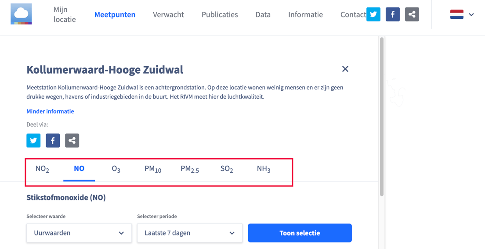
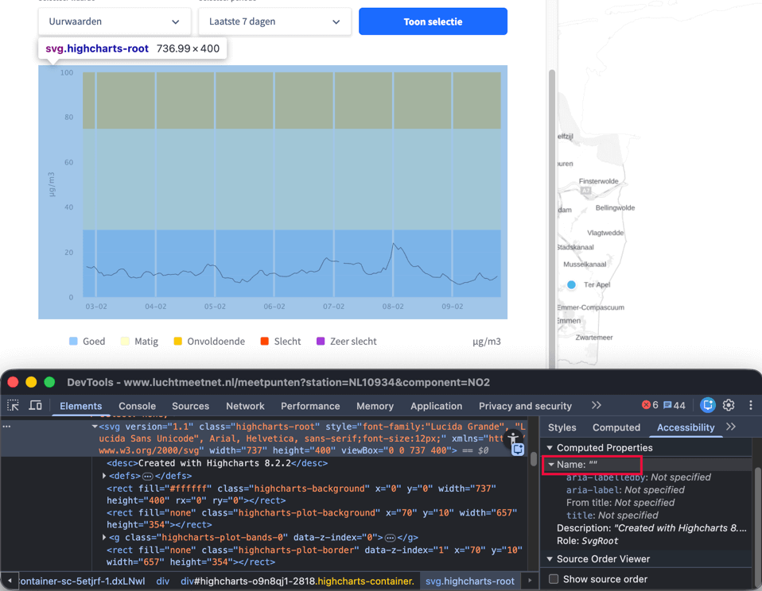

Länk till sidan: [<https://www.luchtmeetnet.nl/meetpunten>](https://www.luchtmeetnet.nl/meetpunten)

På denna sida förekommer tillgänglighetsproblem som redan har beskrivits på andra sidor och som därför inte beskrivs igen här.

### Ologisk fokusordning

	<b>Påverkan</b>: Stor
	<b>Typ</b>: Teknik
	<b>WCAG</b>: 2.4.3, 2.4.11
	<b>EN</b>: 9.2.4.3

På denna sida öppnar flera runda markeringar på kartan paneler med detaljerad information om en vald mätplats på sidan "Meetpunten". Tangentbordsfokus flyttas inte till den nyöppnade panelen utan fortsätter till knapparna på kartan som ligger bakom. Därför hamnar tangentbordsfokus på interaktiva element som inte är synliga, eftersom de ligger bakom den öppnade panelen. Fokusordningen överensstämmer därmed inte med sidans visuella struktur.

Panelen med detaljerad information täcker en del av sidinnehållet. Interaktiva element på den underliggande sidan kan fortfarande få tangentbordsfokus, medan fokusindikatorn inte är synlig.

#### Lösning:

Flytta tangentbordsfokus till nästa logiska element när knappen aktiveras.

Håll tangentbordsfokus inom panelen tills den stängs via stängningsknappen eller med ESC-tangenten. Underliggande interaktiva element får inte ta emot tangentbordsfokus så länge panelen är öppen.

### Felaktig roll för interaktiva element

	<b>Påverkan</b>: Stor
	<b>Typ</b>: Teknik
	<b>WCAG</b>: 4.1.2
	<b>EN</b>: 9.4.1.2

På denna sida öppnas en panel med detaljerad information när de runda markeringarna på kartan aktiveras. I denna panel finns interaktiva element som inte har rätt tillgänglighetsroll. Det gäller elementet med "X"-ikonen, elementet med delningsikonen samt elementen med texterna "Meer informatie" och "Bekijk alle metingen van deze component".

Därför kan hjälpmedel inte korrekt avgöra om det rör sig om en knapp eller en länk.

#### Lösning:

Se till att de interaktiva elementen har rätt tillgänglighetsroll. Använd `<button>`-elementet för knappar och `<a>`-elementet för länkar.

### Stängningsknapp utan tillgängligt namn

	<b>Påverkan</b>: Stor
	<b>Typ</b>: Teknik
	<b>WCAG</b>: 1.1.1, 4.1.2
	<b>EN</b>: 9.1.1.1, 9.4.1.2

På denna sida öppnas en panel med detaljerad information när de runda markeringarna på kartan aktiveras. Denna panel innehåller en "X"-ikon för att stänga den. Denna ikon har inget textalternativ, vilket innebär att det interaktiva elementet saknar tillgängligt namn.

Därför är det inte tydligt för besökare som använder hjälpmedel vad knappens funktion är.

#### Lösning:

Lägg till ett textalternativ vid ikonen eller använd ett 'aria-label' på det interaktiva elementet för att beskriva funktionen.

### Interaktiva element utan tangentbordshantering

	<b>Påverkan</b>: Stor
	<b>Typ</b>: Teknik
	<b>WCAG</b>: 2.1.1
	<b>EN</b>: 9.2.1.1

På denna sida öppnas en panel med detaljerad information när de runda markeringarna på kartan aktiveras. Denna panel innehåller flera interaktiva element som inte kan hanteras med tangentbordet. Det gäller elementet med "X"-ikonen, elementet med texten "Meer informatie", elementet med delningsikonen och elementet med texten "Bekijk alle metingen van deze component".

Därför kan besökare som navigerar med tangentbordet inte aktivera dessa element.

#### Lösning:

Se till att interaktiva element kan hanteras med tangentbordet, till exempel med Enter-, Return- eller mellanslagstangenten.

### Flikar felaktigt markerade

	<b>Påverkan</b>: Medel
	<b>Typ</b>: Teknik
	<b>WCAG</b>: 4.1.2
	<b>EN</b>: 9.4.1.2

<figure class="screenshot">

</figure>

På denna sida öppnas en panel med detaljerad information när de runda markeringarna på kartan aktiveras. I denna panel finns en komponent som ser ut och fungerar som flikar, såsom interaktiva element för att växla mellan ämnena NO₂, NO och O₃. När en flik aktiveras visas nytt innehåll. De nödvändiga rollerna och attributen saknas.

Ett liknande problem förekommer på följande sidor:

- [<https://www.luchtmeetnet.nl/verwacht?component=LKI>](https://www.luchtmeetnet.nl/verwacht?component=LKI) – vid de interaktiva elementen "Luchtkwaliteit", "Stikstofdioxide", "Ozon" och andra
- [<https://www.luchtmeetnet.nl/rapportages>](https://www.luchtmeetnet.nl/rapportages) – vid interaktiva element som "DCMR", "GGD", "ODRA" och andra
- [<https://www.luchtmeetnet.nl/mijn-locatie>](https://www.luchtmeetnet.nl/mijn-locatie) – de interaktiva elementen med texterna "Air quality", "Nitrogen dioxide", "Ozone" och andra är markerade som radioknappar, medan komponenten ser ut och fungerar som flikar

#### Lösning:

Lägg till rätt roller och attribut. Mer information finns på: [<https://www.w3.org/WAI/ARIA/apg/patterns/tabs/>](https://www.w3.org/WAI/ARIA/apg/patterns/tabs/).

### Beskrivning av diagram saknas

	<b>Påverkan</b>: Medel
	<b>Typ</b>: Innehåll
	<b>WCAG</b>: 1.1.1
	<b>EN</b>: 9.1.1.1

<figure class="screenshot">

</figure>

På denna sida finns diagram i panelen som öppnas när de runda markeringarna på kartan aktiveras. Dessa diagram är komplexa bilder och har inget meningsfullt textalternativ.

Under diagrammen finns text och en tabell under "Gemeten concentraties" där uppgifterna presenteras i textform. Diagrammen har inget kort textalternativ som anger att det rör sig om diagram eller att en mer utförlig textbeskrivning finns tillgänglig.

Därför informeras inte besökare som använder hjälpmedel om diagrammens existens eller var den tillhörande textinformationen finns.

#### Lösning:

Lägg till ett kort textalternativ för varje diagram som anger att det rör sig om ett diagram och att detaljerade uppgifter finns tillgängliga i texten och tabellen under "Gemeten concentraties".

### Information i diagram enbart via färg

	<b>Påverkan</b>: Medel
	<b>Typ</b>: Innehåll
	<b>WCAG</b>: 1.4.1
	<b>EN</b>: 9.1.4.1

I diagrammen används enbart färg för att förmedla information, såsom de gula, orange och blå färgerna i teckenförklaringen.

När besökare inte kan se färgerna eller inte kan skilja dem åt är det inte tydligt vilken färg som hör till vilken kategori.

Detta problem förekommer även på sidan:
[<https://www.luchtmeetnet.nl/componenten>](https://www.luchtmeetnet.nl/componenten) i diagrammen som visas när filter har tillämpats.

#### Lösning:

Använd förutom färg även andra visuella markeringar, såsom skuggning eller textetiketter.

### Länkar otillräckligt igenkännbara

	<b>Påverkan</b>: Medel
	<b>Typ</b>: Teknik
	<b>WCAG</b>: 1.4.1
	<b>EN</b>: 9.1.4.1

På denna sida finns i panelen som öppnas när de runda markeringarna på kartan aktiveras ett stycke med länkar, såsom "disclaimer". Dessa länkar kan enbart särskiljas från den omgivande texten genom en färgskillnad.

Därför är det inte tydligt för alla besökare att det rör sig om länkar.

Detta problem förekommer även på följande sidor:

- [<https://www.luchtmeetnet.nl/componenten>](https://www.luchtmeetnet.nl/componenten)
- [<https://www.luchtmeetnet.nl/rapportages>](https://www.luchtmeetnet.nl/rapportages)
- [<https://www.luchtmeetnet.nl/informatie>](https://www.luchtmeetnet.nl/informatie)

#### Lösning:

Färg får användas för att skilja länkar från statisk text förutsatt att följande två villkor är uppfyllda:

- kontrasten mellan länktexten och den omgivande texten är minst 3:1;
- det finns en extra visuell indikator, såsom understrykning eller en ändring vid hover eller fokus.

### Otillräcklig färgkontrast vid liten text

	<b>Påverkan</b>: Medel
	<b>Typ</b>: Teknik
	<b>WCAG</b>: 1.4.3
	<b>EN</b>: 9.1.4.3

På denna sida finns i panelen som öppnas när de runda markeringarna på kartan aktiveras ett stycke med länkar, såsom "disclaimer". Den blå (`#4082FF`) länktexten visas på en vit bakgrund. Kontrastförhållandet är för lågt: 3,6:1.

Detta problem förekommer även på sidan:
[<https://www.luchtmeetnet.nl/componenten>](https://www.luchtmeetnet.nl/componenten). Den blå länktexten, såsom "disclaimer" och "Meer informatie over ontbrekende metingen.", visas där på en ljusgrå (`#FAFBFF`) bakgrund. Kontrastförhållandet är för lågt: 3,5:1.

Se även andra sidor med liknande problem.

#### Lösning:

Eftersom denna text är mindre än 24 pixlar och inte fetstilad måste kontrasten vara minst 4,5:1.

På denna sida finns en instruktion för att testa färgkontrast: [<https://properaccess.nl/hoe-test-ik-kleurcontrast/>](https://properaccess.nl/hoe-test-ik-kleurcontrast/).

### Datatabell felaktigt markerad

	<b>Påverkan</b>: Medel
	<b>Typ</b>: Innehåll
	<b>WCAG</b>: 1.3.1, 1.3.2
	<b>EN</b>: 9.1.3.1, 9.1.3.2

På denna sida finns i panelen som öppnas när de runda markeringarna på kartan aktiveras en datatabell. Denna tabell är inte markerad som tabell i HTML-strukturen.

Därför kan en skärmläsare inte avgöra relationen mellan cellerna. Innehållet läses upp felaktigt eller ofullständigt.

Detta problem förekommer även på följande sidor:

- [<https://www.luchtmeetnet.nl/stations>](https://www.luchtmeetnet.nl/stations) – vid tabellen som visas när provins och timmar har valts
- [<https://www.luchtmeetnet.nl/rapportages>](https://www.luchtmeetnet.nl/rapportages) – vid tabellen som visas när filter har tillämpats
- [<https://www.luchtmeetnet.nl/nieuws>](https://www.luchtmeetnet.nl/nieuws) – vid tabellerna i innehållet som öppnas efter aktivering av objekt i sidomenyn

#### Lösning:

Se till att datatabeller markeras med rätt HTML-element.

Mer information om hur man bygger tillgängliga tabeller finns på: [<https://www.w3.org/WAI/tutorials/tables/>](https://www.w3.org/WAI/tutorials/tables/).

### Funktion för pilikoner saknas

	<b>Påverkan</b>: Stor
	<b>Typ</b>: Teknik
	<b>WCAG</b>: 1.1.1, 4.1.2
	<b>EN</b>: 9.1.1.1, 9.4.1.2

På denna sida finns i panelen som öppnas när de runda markeringarna på kartan aktiveras en tabell under "Gemeten concentraties". I denna tabell finns klickbara pilikoner utan textalternativ.

Därför har dessa knappar inget tillgängligt namn och det är inte tydligt för besökare som använder hjälpmedel vad knapparnas funktion är.

Detta problem förekommer även på följande sidor:

- [<https://www.luchtmeetnet.nl/mijn-locatie>](https://www.luchtmeetnet.nl/mijn-locatie)
- [<https://www.luchtmeetnet.nl/stations>](https://www.luchtmeetnet.nl/stations) – i tabellen som visas när provins och timmar har valts

#### Lösning:

Lägg till ett textalternativ som beskriver knappens funktion, till exempel genom att använda ett textalternativ för ikonen eller genom att lägga till ett aria-label på knappen.

### Dragspelsknapp inte korrekt markerad

	<b>Påverkan</b>: Stor
	<b>Typ</b>: Teknik
	<b>WCAG</b>: 1.3.1, 4.1.2
	<b>EN</b>: 9.1.3.1, 9.4.1.2

På denna sida öppnas, när de runda markeringarna på kartan aktiveras på en liten skärm, en panel med detaljerad information. I denna panel finns en komponent med dolt innehåll "Filter". Elementet som öppnar och stänger detta innehåll har inte rollen knapp.

Dessutom fungerar texten som öppnar och stänger denna dragspelskomponent som rubrik för det tillhörande innehållet, men denna text är inte markerad som rubrik i koden.

Samma problem förekommer på följande sidor:

- [<https://www.luchtmeetnet.nl/stations>](https://www.luchtmeetnet.nl/stations)
- [<https://www.luchtmeetnet.nl/componenten>](https://www.luchtmeetnet.nl/componenten)

#### Lösning:

Använd ett rubrikelement med ett `button`-element inuti, till exempel: `<h2><button>Sektionens titel</button></h2>`.

### Status för dragspel saknas i koden

	<b>Påverkan</b>: Stor
	<b>Typ</b>: Teknik
	<b>WCAG</b>: 1.1.1, 4.1.2
	<b>EN</b>: 9.1.1.1, 9.4.1.2

På denna sida öppnas, när de runda markeringarna på kartan aktiveras på en liten skärm, en panel med detaljerad information. Det öppna eller stängda tillståndet för denna komponent är visuellt synligt men inte fastställt i koden. Pilikonen som indikerar att dolt innehåll finns har inte heller något textalternativ.

Därför är det inte tydligt för besökare som använder en skärmläsare om sektionen är expanderad eller komprimerad.

Samma problem förekommer på sidorna:

- [<https://www.luchtmeetnet.nl/stations>](https://www.luchtmeetnet.nl/stations)
- [<https://www.luchtmeetnet.nl/componenten>](https://www.luchtmeetnet.nl/componenten)

#### Lösning:

Tillämpa attributet `aria-expanded` på knappen som öppnar och stänger sektionen. Värdet ska ändras beroende på sektionens tillstånd. Ett alternativ är att lägga till visuellt dold text som beskriver sektionens tillstånd.

### Dragspel utan tangentbordshantering

	<b>Påverkan</b>: Stor
	<b>Typ</b>: Teknik
	<b>WCAG</b>: 2.1.1
	<b>EN</b>: 9.2.1.1

På denna sida öppnas, när de runda markeringarna på kartan aktiveras på en liten skärm, en panel med detaljerad information. I denna panel finns en komponent med dolt innehåll "Filter".

Elementet som öppnar och stänger detta innehåll kan inte hanteras med tangentbordet. Därför kan besökare som navigerar med tangentbordet inte använda denna komponent.

Samma problem förekommer på följande sidor:

- [<https://www.luchtmeetnet.nl/stations>](https://www.luchtmeetnet.nl/stations)
- [<https://www.luchtmeetnet.nl/componenten>](https://www.luchtmeetnet.nl/componenten)

#### Lösning:

Se till att elementet som öppnar och stänger det dolda innehållet kan hanteras fullt ut med tangentbordet.

