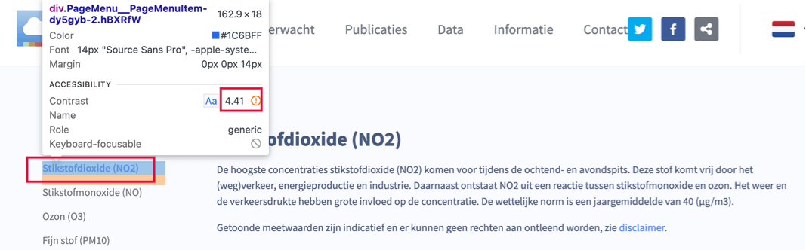

Länk till sidan: [<https://www.luchtmeetnet.nl/componenten>](https://www.luchtmeetnet.nl/componenten)

På denna sida förekommer tillgänglighetsproblem som redan har beskrivits på andra sidor och som därför inte beskrivs igen här.

### Rubrik inte markerad i koden

	<b>Påverkan</b>: Medel
	<b>Typ</b>: Innehåll
	<b>WCAG</b>: 1.3.1
	<b>EN</b>: 9.1.3.1

På denna sida är texten "Componenten" visuellt utformad som rubrik men inte markerad som rubrik i koden.

Därför kan besökare som använder hjälpmedel inte navigera via rubriker på sidan. När rubriker enbart är visuellt utformade och inte är fastställda som rubriker i HTML avviker strukturen i koden från sidans visuella struktur.

På denna sida finns en instruktion för att testa rubrikstrukturen på en webbsida: [<https://properaccess.nl/zo-controleer-je-de-koppenstructuur-van-je-website/>](https://properaccess.nl/zo-controleer-je-de-koppenstructuur-van-je-website/).

Detta problem förekommer även på sidorna:

* [<https://www.luchtmeetnet.nl/nieuws>](https://www.luchtmeetnet.nl/nieuws) (vid "Publicaties");
* [<https://www.luchtmeetnet.nl/informatie>](https://www.luchtmeetnet.nl/informatie) (vid "Informatie");
* [<https://www.luchtmeetnet.nl/contact>](https://www.luchtmeetnet.nl/contact) (vid "Contact").

#### Lösning:

Markera rubriker med rätt `HTML`-element (h1 till och med h6) och tillämpa rätt rubriknivå.

### Felaktig användning av rubrikelement

	<b>Påverkan</b>: Medel
	<b>Typ</b>: Innehåll
	<b>WCAG</b>: 1.3.1
	<b>EN</b>: 9.1.3.1

På denna sida visas texten "Geen data beschikbaar" när inga filter har tillämpats. Denna text är markerad med ett `<h4>`-element men fungerar inte som rubrik.

Texten introducerar inget underliggande innehåll och ger inte sidan någon struktur. Rubrikelementet används här för visuell formatering istället för struktur.

Därför avviker strukturen i koden från sidans faktiska informationsstruktur.

#### Lösning:

Ta bort `<h4>`-elementet och använd ett passande element, såsom ett `
`-element. Tillämpa den visuella formateringen med CSS.

På denna sida finns en instruktion för att testa rubriker på en webbsida: [<https://properaccess.nl/zo-controleer-je-de-koppenstructuur-van-je-website/>](https://properaccess.nl/zo-controleer-je-de-koppenstructuur-van-je-website/).

### Felaktig roll för interaktiva element

	<b>Påverkan</b>: Stor
	<b>Typ</b>: Teknik
	<b>WCAG</b>: 4.1.2
	<b>EN</b>: 9.4.1.2

På denna sida finns under "Componenten" en sidomeny. De interaktiva elementen i denna sidomeny har inte rätt tillgänglighetsroll.

Därför identifierar inte skärmläsare och andra hjälpmedel elementen som interaktiva komponenter. Det är heller inte tydligt vilken funktion de har, vilket försvårar korrekt hantering.

Detta problem förekommer även på sidorna:

* [<https://www.luchtmeetnet.nl/nieuws>](https://www.luchtmeetnet.nl/nieuws) (under "Publicaties")
* [<https://www.luchtmeetnet.nl/informatie>](https://www.luchtmeetnet.nl/informatie) (under "Informatie")
* [<https://www.luchtmeetnet.nl/contact>](https://www.luchtmeetnet.nl/contact) (under "Contact")

#### Lösning:

Se till att de interaktiva elementen får rätt roll.

### Interaktiva element utan tangentbordshantering

	<b>Påverkan</b>: Stor
	<b>Typ</b>: Teknik
	<b>WCAG</b>: 2.1.1
	<b>EN</b>: 9.2.1.1

På denna sida finns under "Componenten" en sidomeny. De interaktiva elementen i denna sidomeny kan inte hanteras med tangentbordet.

Därför kan besökare som navigerar med tangentbordet inte aktivera de interaktiva elementen.

Detta problem förekommer även på sidorna:

* [<https://www.luchtmeetnet.nl/nieuws>](https://www.luchtmeetnet.nl/nieuws) (under "Publicaties")
* [<https://www.luchtmeetnet.nl/informatie>](https://www.luchtmeetnet.nl/informatie) (under "Informatie")
* [<https://www.luchtmeetnet.nl/contact>](https://www.luchtmeetnet.nl/contact) (under "Contact")

#### Lösning:

Se till att interaktiva element kan hanteras fullt ut med tangentbordet, till exempel med Enter-, Return- eller mellanslagstangenten.

### Otillräcklig färgkontrast vid sidomeny

	<b>Påverkan</b>: Medel
	<b>Typ</b>: Teknik
	<b>WCAG</b>: 1.4.3
	<b>EN</b>: 9.1.4.3

<figure class="screenshot">

</figure>

På denna sida finns under "Componenten" en sidomeny. Det aktiva (valda) objektet har en blå (`#1B6BFF`) färg på en ljusgrå (`#FAFBFF`) bakgrund. Kontrastförhållandet är för lågt: 4,4:1.

Detta problem förekommer även på sidorna:

* [<https://www.luchtmeetnet.nl/nieuws>](https://www.luchtmeetnet.nl/nieuws) (under "Publicaties")
* [<https://www.luchtmeetnet.nl/informatie>](https://www.luchtmeetnet.nl/informatie) (under "Informatie")
* [<https://www.luchtmeetnet.nl/contact>](https://www.luchtmeetnet.nl/contact) (under "Contact")

#### Lösning:

Se till att kontrasten för denna text är minst 4,5:1. På denna sida finns en instruktion för att testa färgkontrast: [<https://properaccess.nl/hoe-test-ik-kleurcontrast/>](https://properaccess.nl/hoe-test-ik-kleurcontrast/).

### Diagram utan beskrivning

	<b>Påverkan</b>: Medel
	<b>Typ</b>: Innehåll
	<b>WCAG</b>: 1.1.1
	<b>EN</b>: 9.1.1.1

På denna sida visas, när filter har tillämpats, diagram. Dessa diagram är komplexa bilder och har inget kort textalternativ eller utförlig beskrivning.

Därför är informationen i diagrammen inte tillgänglig för besökare som inte kan se bilden.

#### Lösning:

Lägg till en kort beskrivning vid diagrammet och erbjud dessutom en utförlig textbeskrivning. Denna beskrivning kan finnas på själva sidan eller göras tillgänglig via en separat sida eller en nedladdningsbar fil.

### Status för dragspel saknas i koden

	<b>Påverkan</b>: Stor
	<b>Typ</b>: Teknik
	<b>WCAG</b>: 1.1.1, 4.1.2
	<b>EN</b>: 9.1.1.1, 9.4.1.2

På denna sida finns, när den visas på en liten skärm, en knapp som öppnar en komponent med dolt innehåll. Den synliga texten på knappen är från början "Stikstofdioxide (NO2)".

Det öppna eller stängda tillståndet för denna komponent är visuellt synligt men inte fastställt i koden. Pilikonen som indikerar att dolt innehåll finns har inte heller något textalternativ.

Därför är det inte tydligt för skärmläsaranvändare om sektionen är expanderad eller komprimerad.

Detta problem förekommer även på sidan:
[<https://www.luchtmeetnet.nl/contact>](https://www.luchtmeetnet.nl/contact) - vid knappen som från början har etiketten "Algemeen Luchtmeetnet").

#### Lösning:

Tillämpa attributet `aria-expanded` på knappen som öppnar och stänger sektionen, så att värdet ändras beroende på tillståndet. Ett alternativ är att lägga till visuellt dold text som beskriver sektionens tillstånd.

