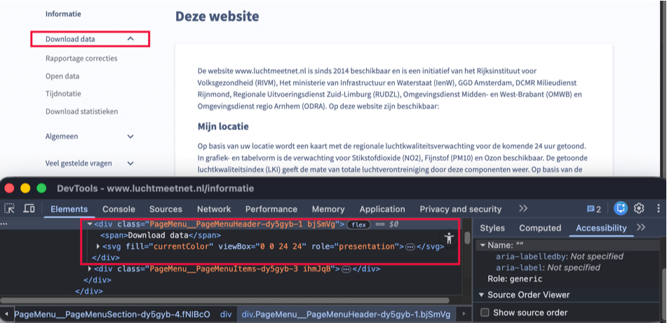

Länk till sidan: [<https://www.luchtmeetnet.nl/informatie>](https://www.luchtmeetnet.nl/informatie)

På denna sida förekommer tillgänglighetsproblem som redan har beskrivits på andra sidor och som därför inte beskrivs igen här.

### Hopplänk saknas

	<b>Påverkan</b>: Medel
	<b>Typ</b>: Teknik
	<b>WCAG</b>: 2.4.1
	<b>EN</b>: 9.2.4.1

På denna sida saknas en lösning för att hoppa över block med upprepat innehåll. Sidan innehåller en sidomeny. Genom att aktivera objekt i denna meny öppnas nytt innehåll, men det finns ingen hopplänk för att hoppa över navigeringen i sidhuvudet.

Dessutom finns det ingen tangentbordsmekanism för att kringgå de upprepade objekten i sidomenyn. Därför måste besökare som navigerar med tangentbordet på varje öppnad sida först tabba igenom samma navigationslänkar innan de når huvudinnehållet.

#### Lösning:

Se till att besökare kan hoppa över fasta delar av sidan och gå direkt till huvudinnehållet, till exempel med en hopplänk.

En hopplänk måste vara den första länken på sidan. Den får vara dold som standard men måste bli synlig så snart den får tangentbordsfokus.

### Dragspelsknapp har felaktig roll

	<b>Påverkan</b>: Stor
	<b>Typ</b>: Teknik
	<b>WCAG</b>: 4.1.2
	<b>EN</b>: 9.4.1.2

<figure class="screenshot">

</figure>

På denna sida finns en sidomeny. I denna meny innehåller komponenter med dolt innehåll ett element som öppnar och stänger innehållet. Detta element har inte rollen knapp.

Därför identifieras elementet inte som en interaktiv komponent.

#### Lösning:

Använd ett rubrikelement med ett `button`-element inuti, till exempel: `<h2><button>Sektionens titel</button></h2>`.

### Pilikoner i dragspel utan textalternativ

	<b>Påverkan</b>: Stor
	<b>Typ</b>: Teknik
	<b>WCAG</b>: 1.1.1, 4.1.2
	<b>EN</b>: 9.1.1.1, 9.4.1.2

På denna sida finns i sidomenyn komponenter med dolt innehåll. Pilikonen som indikerar att dolt innehåll finns har inget textalternativ.

Därför är det inte tydligt för besökare som använder en skärmläsare att komponenten kan öppnas eller stängas.

#### Lösning:

Se till att dragspelskomponentens funktion och status finns tillgänglig i koden. Detta kan till exempel göras genom att:

* lägga till ett textalternativ för ikonen;
* använda ett 'aria-expanded'-attribut på det interaktiva elementet;
* lägga till visuellt dold text som beskriver tillståndet.

### Vallista (`<select>`-element) saknar etikett eftersom första alternativet används som etikett

	<b>Påverkan</b>: Medel
	<b>Typ</b>: Teknik
	<b>WCAG</b>: 3.3.2
	<b>EN</b>: 9.3.3.2

På denna sida finns, när den visas på en liten skärm, ett `<select>`-element utan etikett. Det första alternativet i elementet används som etikett, men detta försvinner så snart ett annat alternativ väljs.

Därför är det inte tydligt vad vallistan handlar om.

Detta problem förekommer även på:

* [<https://www.luchtmeetnet.nl/informatie/download-data/download-statistieken>](https://www.luchtmeetnet.nl/informatie/download-data/download-statistieken)
* [<https://www.luchtmeetnet.nl/informatie/metingen/keuze-meetlocaties>](https://www.luchtmeetnet.nl/informatie/metingen/keuze-meetlocaties)
* [<https://www.luchtmeetnet.nl/informatie/verwachting/verwacht>](https://www.luchtmeetnet.nl/informatie/verwachting/verwacht)
* [<https://www.luchtmeetnet.nl/informatie/overige/validatie-data>](https://www.luchtmeetnet.nl/informatie/overige/validatie-data)

#### Lösning:

Förse `<select>`-elementet med en synlig och bestående etikett.

