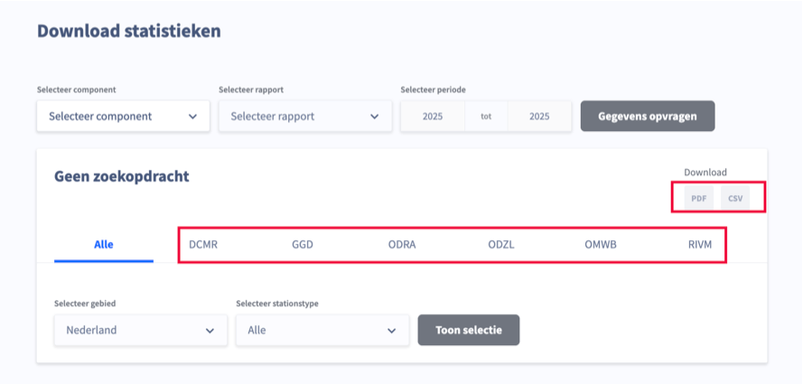

Länk till sidan:  [<https://www.luchtmeetnet.nl/rapportages>](https://www.luchtmeetnet.nl/rapportages)

På denna sida förekommer tillgänglighetsproblem som redan har beskrivits på andra sidor och som därför inte beskrivs igen här.

### Gruppering av inmatningsfält saknas

	<b>Påverkan</b>: Medel
	<b>Typ</b>: Teknik
	<b>WCAG</b>: 1.3.1
	<b>EN</b>: 9.1.3.1

På denna sida finns en grupp inmatningsfält med texten "Selecteer periode" ovanför. Dessa fält är visuellt grupperade men denna relation är inte fastställd i HTML.

Därför är sambandet mellan inmatningsfälten inte tydligt i koden.

#### Lösning:

Placera inmatningsfälten i ett `<fieldset>`-element och använd ett `<legend>`-element för att ge gruppen ett namn, till exempel "Selecteer periode".

### Inmatningsfält utan tillgängligt namn

	<b>Påverkan</b>: Stor
	<b>Typ</b>: Teknik
	<b>WCAG</b>: 4.1.2
	<b>EN</b>: 9.4.1.2

På denna sida saknar inmatningsfälten under "Selecteer periode" tillgängligt namn.

Därför är det inte tydligt för skärmläsaranvändare vad de ska fylla i inmatningsfältet.

#### Lösning:

Ge varje inmatningsfält ett tillgängligt namn genom att koppla ett `<label>`-element till fältet.

### Otillräcklig färgkontrast vid liten text

	<b>Påverkan</b>: Medel
	<b>Typ</b>: Teknik
	<b>WCAG</b>: 1.4.3
	<b>EN</b>: 9.1.4.3

<figure class="screenshot">

</figure>

När filter inte har tillämpats finns under "Download" grå (`#A3ABBC`) texter "PDF" och "CSV". På den ljusgrå (`#F1F3F6`) bakgrunden är kontrastförhållandet för lågt: 2,1:1.

Dessutom finns det grå (`#6C7996`) texter som "DCMR" och "GGD" på en vit bakgrund. Kontrastförhållandet är 4,4:1 och uppfyller därmed inte kravet.

#### Lösning:

Eftersom denna text är mindre än 24 pixlar och inte fetstilad måste kontrasten vara minst 4,5:1. På denna sida finns en instruktion för att testa färgkontrast: [<https://properaccess.nl/hoe-test-ik-kleurcontrast/>](https://properaccess.nl/hoe-test-ik-kleurcontrast/).

