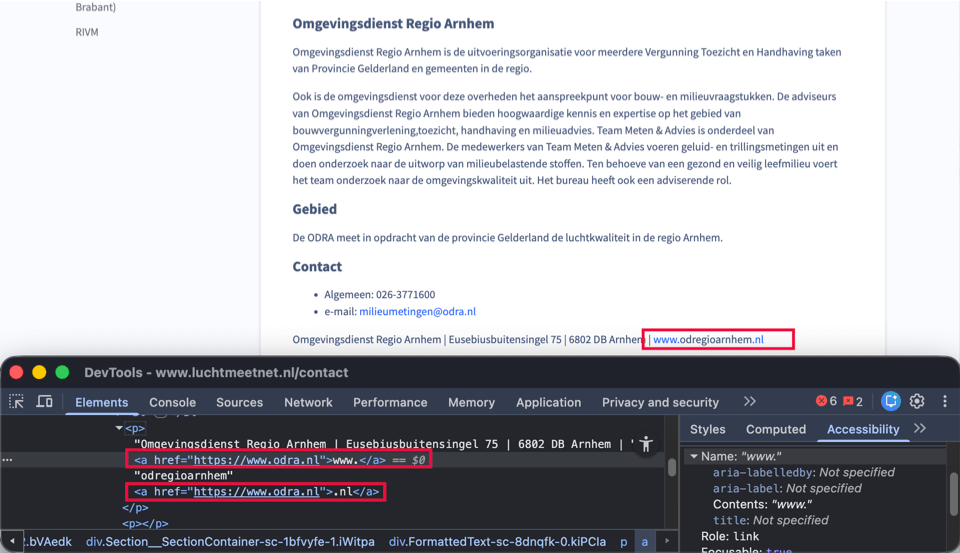
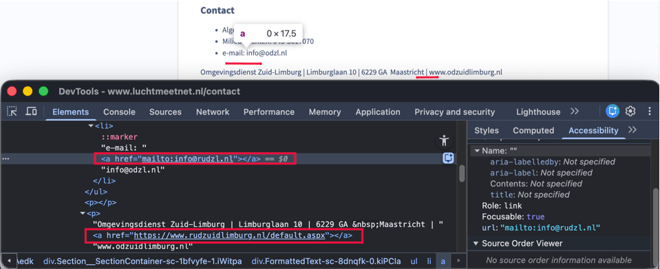

Länk till sidan: [<https://www.luchtmeetnet.nl/contact>](https://www.luchtmeetnet.nl/contact)

På denna sida förekommer tillgänglighetsproblem som redan har beskrivits på andra sidor och som därför inte beskrivs igen här.

### Otydligt länkmål

	<b>Impact</b>: Groot
	<b>Type</b>: Techniek
	<b>WCAG</b>: 2.4.4
	<b>EN</b>: 9.2.4.4

<figure class="screenshot">

</figure>

I innehållet som öppnas vid aktivering av "ODRA (Regio Arnhem)" i sidomenyn finns under rubriken "Contact" webbadressen "[www.odregioarnhem.nl](http://www.odregioarnhem.nl)". Denna webbadress är uppdelad i två separata länkar: "www." och ".nl". Texten "odregioarnhem" ingår inte i länken.

Därför erbjuds inte den fullständiga webbadressen som en tydlig länk till hjälpmedel. De separata delarna annonseras var för sig, vilket gör länkens mål otydligt.

#### Lösning:

Implementera den fullständiga webbadressen som en länk. Placera hela URL:en inom ett `<a>`-element, så att den annonseras och aktiveras som en tydlig länk.

### Osynligt element får tangentbordsfokus

	<b>Impact</b>: Groot
	<b>Type</b>: Techniek
	<b>WCAG</b>: 2.4.3
	<b>EN</b>: 9.2.4.3

<figure class="screenshot">

</figure>

På denna sida hamnar, i innehållet som öppnas vid aktivering av "ODZL (Limburg)" i sidomenyn, tangentbordsfokus på icke-synliga interaktiva länkar under rubriken "Contact".

Tangentbordsfokus får inte hamna på interaktiva element som inte är synliga. Om detta ändå sker kan en besökare oavsiktligt aktivera ett element och navigeringen blir oförutsägbar.

#### Lösning:

Se till att enbart synliga element kan få tangentbordsfokus och att fokusordningen förblir logisk och förutsägbar.

### Länk utan tillgängligt namn

	<b>Impact</b>: Groot
	<b>Type</b>: Techniek
	<b>WCAG</b>: 4.1.2, 2.4.4
	<b>EN</b>: 9.4.1.2, 9.2.4.4

På denna sida finns i innehållet som öppnas vid aktivering av "ODZL (Limburg)" i sidomenyn två icke-synliga länkar under rubriken "Contact". Dessa länkar är tillgängliga för skärmläsare men saknar tillgängligt namn.

Därför är det inte tydligt för skärmläsaranvändare vad länkarnas mål eller destination är. Detta hänger samman med framgångskriterium 2.4.4, eftersom länkar måste ha ett tydligt syfte.

#### Lösning:

Ge länken ett tillgängligt namn, till exempel med en synlig länktext eller ett `aria-label`.

På denna sida finns en instruktion för att testa tillgängliga namn: [<https://www.properaccess.nl/blog/sc-4-1-2-wat-betekent-naam-rol-waarde/>](https://www.properaccess.nl/blog/sc-4-1-2-wat-betekent-naam-rol-waarde/).

